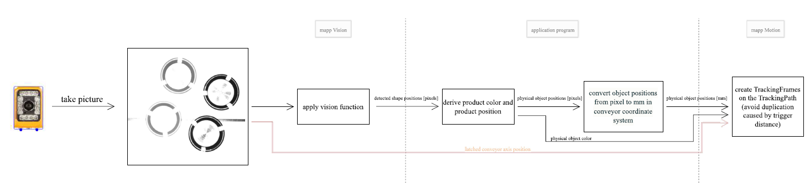
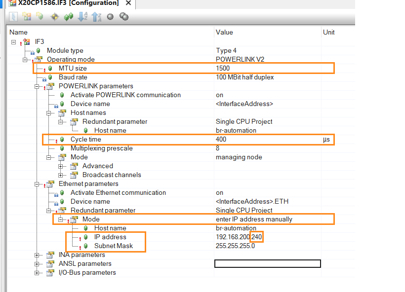
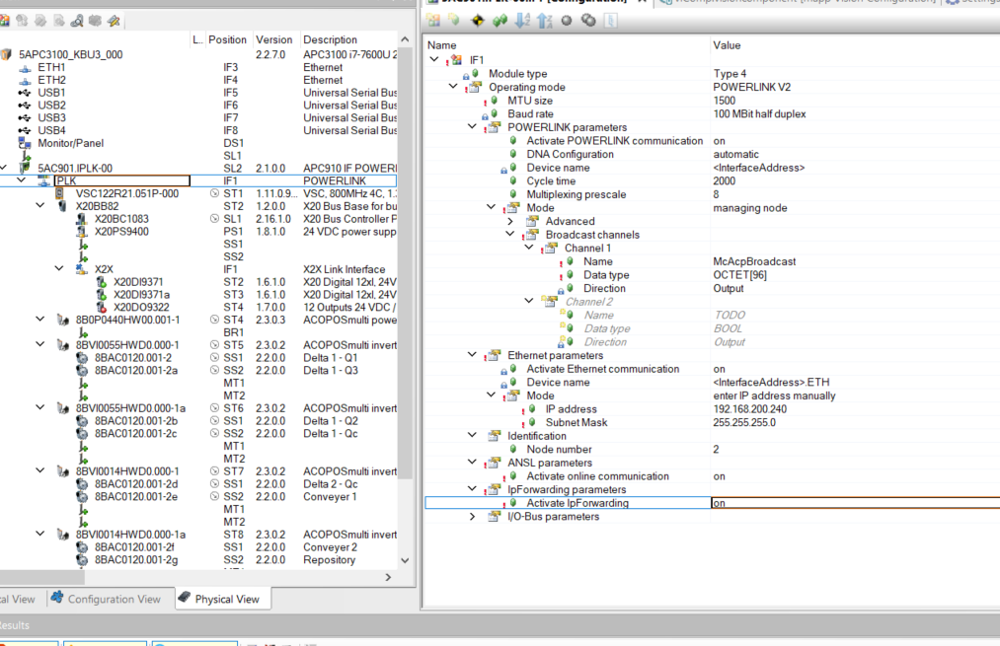
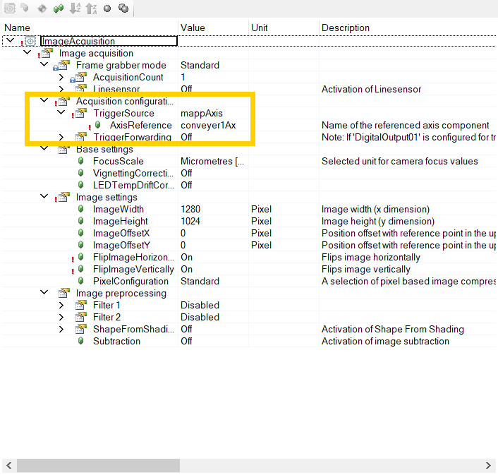
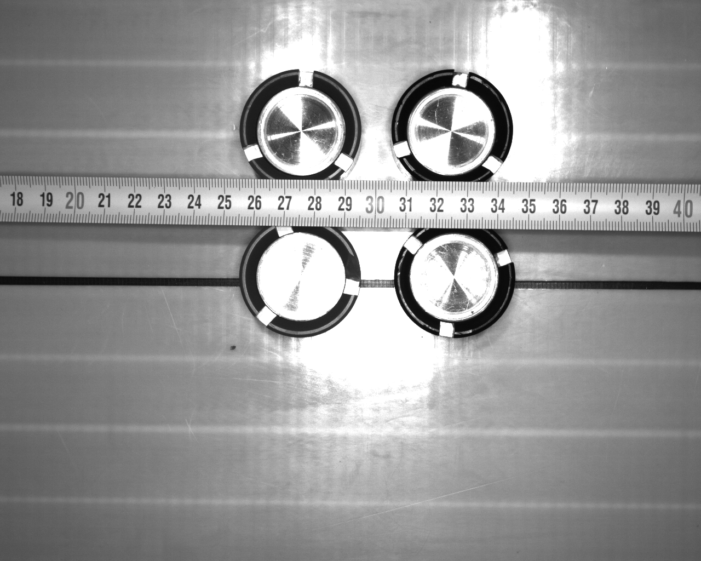
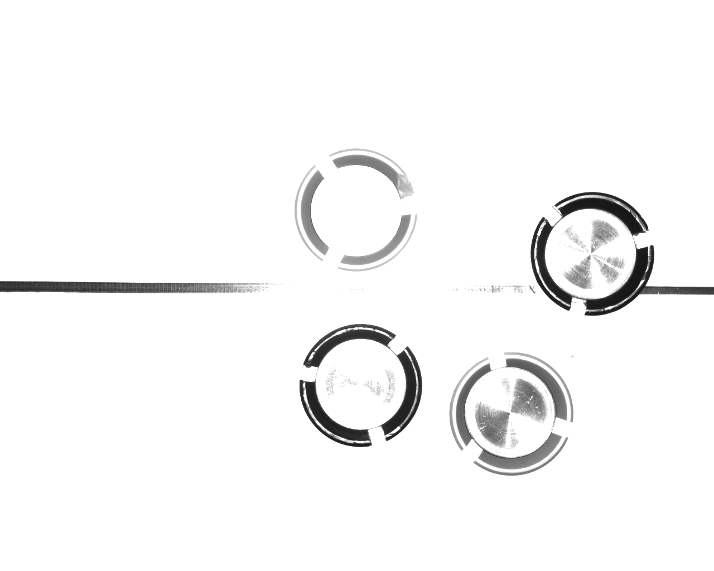
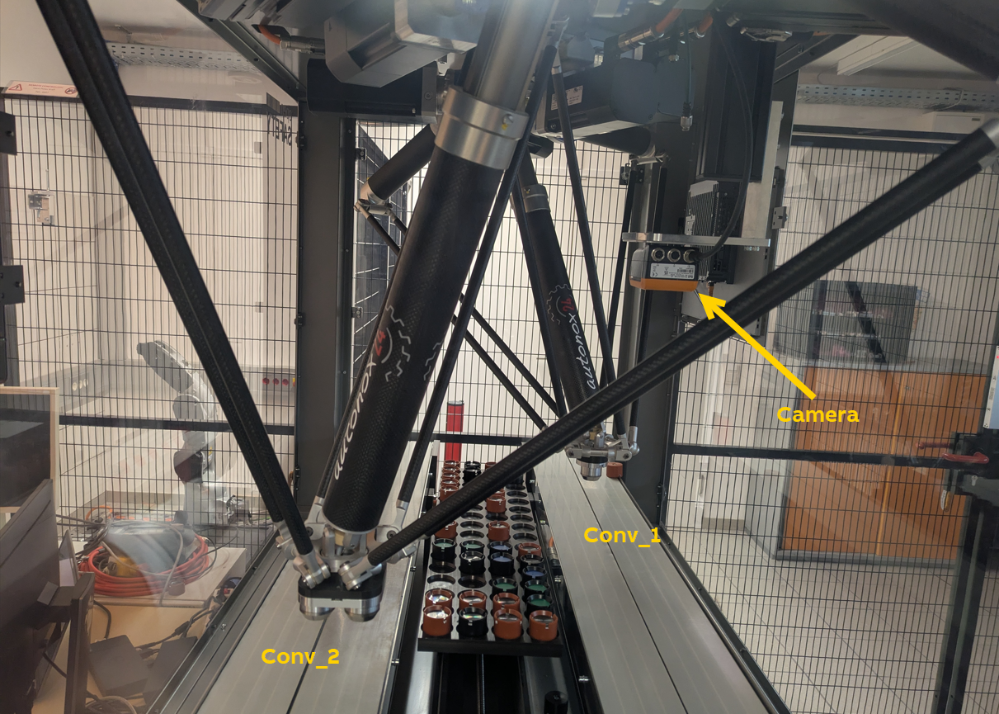
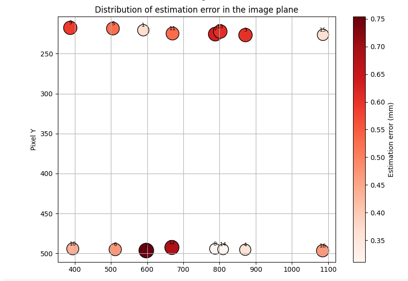

# mappRobotics-Sample-PickAndPlaceProcess

## Scope

This sample demonstrates a dual-robot pick-and-place system using B&R's mapp Robotics and Conveyor Tracking technologies. Robot 1 picks individual objects from a conveyor and places them into containers, while Robot 2 transfers filled containers between conveyors. The system includes a buffer for temporary object storage and showcases a design to handle multiple pick-and-place jobs with priority-based scheduling.

This is a demonstration/training example focused on feature integration rather than production implementation. It does not include production-grade safety protocols or comprehensive error handling.

https://github.com/user-attachments/assets/d4283c99-f4b8-4b0e-b12e-de0a676b7322

## Prerequisites

- B&R Automation Studio 6.3.1 or later
- Automation Runtime 6.3.4
- mapp Motion 6.4.1
- mapp View 6.3.1  
- mapp Cockpit 6.3.1
-  [OPC UA C/S 6.3.1](https://www.br-automation.com/en-gb/downloads/software/automation-studio/automation-studio-6/v63-tp-upgrade-opcuacs-6312/)
- mapp Vision 6.0.0
- Scene Viewer 6.1.2
- Basic understanding of Structured Text and robot Motion Structured Text (MotionST) programming
- Familiarity with mapp Robotics and Conveyor Tracking concepts

## How to Run the Simulation
 **This branch cannot be executed in a simulated environment because the camera's functionality cannot be simulated**

1. Open `PickAndPlace.apj` (ensure required technology packages are installed)
2. Activate Simulation mode
3. Transfer to target (ArSim)
4. Open Watch window for 'Mechanics' task (Logical View → Tasks → MechanicsManager) and add 'Cmd' structure
5. Set `PowerAndHome` to `TRUE`
6. Set `MoveConveyor1` to `TRUE`
7. Set `MoveConveyor2` to `TRUE`
8. Set `MoveProgramRobot1` to `TRUE`
9. Set `MoveProgramRobot2` to `TRUE`
10. Open 3D visualization (Logical View → Scene → Customized)
11. In Scene Viewer: Online → OPC UA → Connect
    - Target: `127.0.0.1`
    - Username: `gmctest`
    - Password: `gmctest`
12. Click 'OK' to connect the 3D visualization to the simulated PLC

## Main components used in this Automation Studio project

- Component **AxesGroup**
  - AxesGroup feature **Tracking**
  - AxesGroup feature **TrackingFrame selection**
    - With defined Selection Areas
  - AxesGroup feature **Programs**
- Component **TrackingPath**

## Notes

- **Troubleshooting**: Check Logger for error entries if issues occur
- **Error Recovery**: Restart the simulated PLC to recover from errors
- **Runtime Changes**: Most settings under `Cmd.Settings` can be modified during operation
- **Robot program state**: Add 'MotionProgramRob1' and 'MotionProgramRob2' to the Watch window to observe the current state of the robot programs
- **Agility Changes**: When changing `AgilityReductionFactor`, ensure robot programs are stopped (`Cmd.MoveProgramRobotX = FALSE`)
- **3D Visualization**: Object states in the visualization update during motion planning and object selection, not during actual physical operations. For example, objects disappear from pick positions when the robot selects them for a task, rather than when the robot physically picks them up. Container color coding indicates fill state:
  - Red: Empty container
  - Yellow: Partially filled container  
  - Green: Full container
- **TrackingFrame user data and attribute-based selection**: This sample demonstrates how the TrackingFrame's user data and attribute can represent single items and containers, including their fill state and contained product IDs. This information enables automatic TrackingFrame selection based on object characteristics.

 

# B&R Camera Integration
This section outlines the complete process for integrating a B&R camera with the mappRobotics Conveyor Tracking solution, as implemented in the mappRobotics-Sample-PickAndPlaceProcess use case. The steps cover:

- **Implementation** (mappVision, mappRobotics, latch position, etc.)
- **Calibration** (distortion correction, camera-to-conveyor and robot calibration, etc.)

<b>From Camera Image to Frame Creation</b>

  

## Camera Configuration

**Initial Setup:**  
Begin by following the [mapp Vision getting started guide](https://help.br-automation.com/#/en/6/machine_vision/mapp_vision/getting_started/getting_started.html) to establish the basic camera configuration.

**Configuration Adjustments:**  
Several key settings were customized beyond those described in the online help documentation:

- **IP Forwarding and ANSL Communication:** Both features were enabled to ensure correct data exchange across the system’s network.
- **POWERLINK Configuration:** The cycle time was set to 2,000 ms, differing from the default guide settings.

**Reference:**  
The help documentation provided initial guidance; however, the final configuration was adapted to meet the specific requirements of this system.

  
  

## Camera Triggering

- **Automatic Triggering Using Axis Position:**
    
    The camera is triggered automatically based on conveyor movement, taking images at regular intervals (every 70mm) to reliably detect all objects, minimizing errors from inconsistent lighting at the image edges.

    The B&R camera supports automatic image acquisition based on the position of an axis. In this project, that feature was used to synchronize image capture with the conveyor movement.

- **Configuration:**

    On the camera’s properties page, you can select an axis as the trigger source. For this setup, the axis directly below the camera—Conveyor1—was chosen. This means the camera takes a picture each time the conveyor advances a certain distance.
  
    

      
    

- **Setting the Trigger Interval:**
    
    Using the function block `ViBaseAxisBasedAcquisition`, you can configure how often the camera captures an image, based on the conveyor’s motion.
    - For example: If you set the period to 80mm, the camera will take a new picture every time the conveyor has advanced by 80mm.

- **ROI and FOV Considerations:**
    - The Region of Interest (ROI) was set to cover the entire image area.
    - The Field of View (FOV) along the conveyor’s movement direction is approximately 130mm.
    
    

      
    

    - Ideally, you would set the trigger interval to be slightly less than the FOV minus the object’s diameter, e.g., 130mm–40mm (with 40mm being the object diameter).

  -  However, in this project, it was more reliable to use a **conservative interval of 70mm**. *Any resulting duplicate detections due to overlapping images are removed using a filtering process.*

- **Reason for Conservative Setting:**

     The lighting is not perfectly uniform across the entire image. Objects located near the borders may not always be detected correctly due to uneven illumination.
     By reducing the trigger distance, each part of the conveyor is imaged with some overlap, helping to ensure that every object is fully captured in at least one well-lit section of an image.

## From camera picture to frame creation

### Apply Vision Function
After configuring the camera, create a Vision Function to detect objects in the captured images.

The camera analyzes each image, distinguishing lighter and darker regions. In this system, lighter areas correspond to red objects, while darker areas represent black objects.

  

Object recognition is performed using a matching Vision Function with two separate models:
- One model detects black objects.
- The other model detects all objects, regardless of color.

**Result:** In the provided example, the camera detects a total of 6 objects—2 black and 4 red+black.

### Deriving Product Color and Position
**Issue:** Black objects are detected twice (once by each model), resulting in duplicate detections.

**Solution:** The Filtering Output action removes these duplicates during post-processing.

**Purpose:** This ensures each object is counted only once and clearly classified as red or black, resulting in clean and accurate detection results.

After filtering, 4 objects remain, each with X and Y positions specified in pixels.

The next step is to convert these pixel coordinates to millimeters (mm) using a known reference coordinate system. This allows for precise mapping of object positions within the system and ensures correct placement in the object hierarchy.

### Convert object positions from pixel to mm in conveyor coordinate system

**Setup:** The camera is mounted above conveyor 1. Both conveyor 1 and conveyor 2 are part of the same system and are already linked together in the object hierarchy.

  

**Goal:**
The goal is not to determine the camera's absolute position in the world. Instead, the objective is to establish a relationship between:
- The image plane (pixel coordinates from camera images)
- The system's reference coordinate system (millimeter coordinates)

**Why?**
This relationship enables conversion of pixel coordinates to real-world millimeter coordinates, ensuring accurate localization of detected objects within the system.

**Practical Approach:**
For this demonstration, an ideal scenario is assumed:
- All reference systems (conveyors, robots) are correctly linked in the object hierarchy.
- The application can operate without the camera, provided the positions of all other system components are known and properly referenced, except for the camera itself.

**How Calibration Works:**
- Known Placement: Use the robot to precisely place an object at a specific spot on conveyor 1 (with known millimeter coordinates).
- Capture Image and Move: Move the conveyor, track the object as it moves, and capture images at different positions.
- Data Collection: For each image, record the pixel coordinates (from the camera) and the corresponding real-world millimeter coordinates (from the conveyor system).
- Compute Mapping: With sufficient matching data points, calculate an affine transformation matrix. This matrix maps pixel coordinates to millimeter coordinates.

**Result:**
Using the affine matrix, new detections in camera images (pixel coordinates) can be quickly and accurately converted to millimeter coordinates within the system’s reference frame, ensuring precise object localization for subsequent tasks.

The error estimation is illustrated below:

  

**Consideration:** The objects were well distributed along the X axis, but coverage along the Y axis was limited. For optimal calibration, collect more data points in both directions.

However, as the application performed well with the current setup, the existing calibration was sufficient for now.

The Python calibration script is available at: [CameraCalib.py](./CameraIntegration/CameraCalibration/CameraCalib.py)

###  Mathematical Definition of the Transformation used 

Given the pixel coordinates $(x, y)$ of a detected object in the camera image:

$$
\begin{bmatrix}
  x \\
  y \\
  1
\end{bmatrix}
$$

The corresponding position in the conveyor's reference frame (in millimeters) is calculated as:

$$
 \begin{bmatrix}
  X_{mm} \\
  Y_{mm}
\end{bmatrix} = 
\begin{bmatrix}
  x & y & 1
\end{bmatrix}
\cdot  M
$$

where the affine transformation matrix $M$ is:

$$
M =
\begin{bmatrix}
  m_{11} & m_{12} \\
  m_{21} & m_{22} \\
  m_{31} & m_{32}
\end{bmatrix}
$$

The explicit mapping equations are:

$$
\begin{aligned}
X_{mm} &= m_{11} \cdot x + m_{21} \cdot y + m_{31} \\ 
Y_{mm} &= m_{12} \cdot x + m_{22} \cdot y + m_{32}
\end{aligned}
$$

---

### Result of the Python script

$$
M =
\begin{bmatrix}
  -0.179524 & -0.001535 \\
   0.002123 &  0.183691 \\
1102.5163  & -89.8258
\end{bmatrix}
$$

So, the explicit mapping is:

$$
\begin{aligned}
X_{mm} = -0.179524 \cdot x + 0.002123 \cdot y + 1102.5163 \\   
Y_{mm} = -0.001535 \cdot x + 0.183691 \cdot y - 89.8258
\end{aligned}
$$

### Symbols

*x, y*: Pixel coordinates from camera detection
$X_{mm}, Y_{mm}$: Real-world millimeter coordinates
$M$: Affine transformation matrix (values from calibration above)
The third column of the input vector (the "1") enables translation.

This transformation enables direct conversion of detected object positions from image pixel coordinates to millimeter coordinates within the conveyor's reference frame, using the affine matrix obtained through calibration.

## Create TrackingFrames on the TrackingPath

After determining each object's position in millimeters (referenced to the conveyor), create frames to map these positions within the automation system. Use the function block `MC_BR_TrackingFramesCreate` to generate multiple frames simultaneously.

**Key Point:**
Because camera acquisition occurs periodically, the same object may be detected in multiple images. To prevent duplicate frames for a single physical object, a filtering algorithm is implemented.

**Retrieve Existing Frames:**
Use the function block `MC_BR_TrackingPathGetFrames` to retrieve the positions of all existing frames on the conveyor.

**Distance-Based Duplication Check:**
For each newly detected object (with position $(X_{mm}, Y_{mm})$), calculate the Euclidean distance to all existing frames.

**Formula:**

$$
d_i = \sqrt{(X_{mm,new} - X_{mm,existing})^2 + (Y_{mm,new} - Y_{mm,existing})^2}
$$

If all $d_i$ values exceed a defined threshold (such as the minimum allowed distance between distinct objects, based on object diameter or detection uncertainty), create a new frame for the object.

If any $d_i$ is less than or equal to the threshold, consider the object already tracked and do not create a new frame.

**Summary of the Filtering Algorithm:**

For every new object:
- Retrieve current frames on the conveyor.
- If its distance to all existing frames exceeds the defined threshold, create a new frame.
- Otherwise, skip to avoid duplication.

This approach ensures that each physical object on the conveyor is associated with a single frame, regardless of how many times it is detected across multiple camera acquisitions.

---

### Frame Creation – Latching Position

**Importance of Latching Position:**
- The latching position records the exact conveyor axis position at the moment the image is captured.
- Using this value ensures that frames for detected objects are created with precise positional accuracy.

**Further Information:**  
For more details, refer to the MpPick (mappMotion pick-and-place process solution) documentation. While MpPick offers different interfaces, the linked section provides a general overview of the concept of latching the conveyor position:  
https://help.br-automation.com/#/de/6/motion/mapp_motion/mapp_robotics/programmierung/lib/pick/technische_informationen/latched_conveyor_position.html

